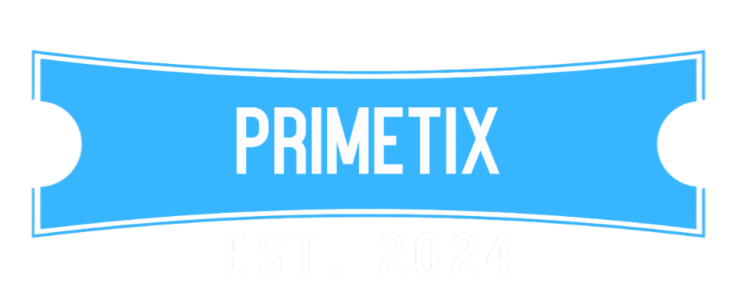

# 🎫PrimeTix

PrimeTix is an online platform for booking movie tickets, offering a streamlined and interactive experience for users. It allows moviegoers to easily explore a wide range of films, check show timings, watch trailers, and conveniently book tickets for their preferred shows. With its intuitive interface and responsive design, PrimeTix ensures a user-friendly journey from browsing to booking.

# ✅ Key Features

- Dynamic Movie Listings: Users can view the latest movie titles along with essential details such as genre and showtimes.

- Movie Trailers: Each movie card includes a direct link to its YouTube trailer, allowing users to preview the film before booking.

- Seamless Ticket Booking: The platform offers a smooth process for selecting seats and completing bookings.

- Responsive Design: Optimized for both desktop and mobile devices, providing a consistent experience across platforms.

- User Interaction: The website integrates with modern web technologies, such as React, to ensure a fast and interactive user interface.

# 🗒️ Languages Used

- HTML
- JAVASCRIPT
- CSS

# 🎯New Update

- Added React (You can access the React Page From React Folder in the main Branch)

# 🎬Screenshots

# 🚀 TEAM

- [Arshit Kataria (2310991793)](https://github.com/arshitkataria2)
- [Arjun Singla (2310991787)](https://github.com/arsingla) 
- [Arshdeep Singh (230991792)](https://github.com/arshdeep4450)
- [Athrv Mahajan (2310990138)](https://github.com/aivar-14)

